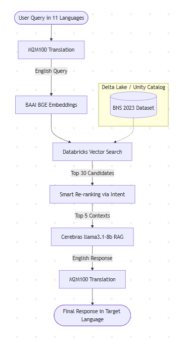

# NyayaRakshak - BNS Legal RAG System

## 🎯 What it does

NyayaRakshak is an intelligent legal assistant that provides instant, accurate answers about India's Bharatiya Nyaya Sanhita (BNS) 2023. It features a dual-mode system to offer either easy-to-understand explanations or detailed professional legal analyses with exact section citations across 11 different Indian languages.

## 🏗️ Architecture



## 🚀 How to Run

1. **Clone the repository**:
   ```bash
   git clone https://github.com/kr-Ayaman/NyayaRakshak.git
   cd NyayaRakshak
   ```

2. **Install dependencies**:
   ```bash
   pip install -r requirements.txt
   ```

3. **Start Jupyter Notebook**:
   ```bash
   jupyter notebook
   ```

4. **Run the Code**:
   - Open `BNS_Legal_RAG_System.ipynb`
   - Select "Run All Cells" to execute the pipeline and start the server.

*(Note: To run in Databricks, upload the notebook, attach to a serverless cluster, run `%pip install -r requirements.txt`, and execute all cells).*

## 🎮 Demo Steps

1. **Launch the UI**: Click on the public browser UR e.g. [https://963b6c74a0d02a1439.gradio.live](https://963b6c74a0d02a1439.gradio.live) printed at the very bottom of the notebook output.
2. **Select Language**: Click the language dropdown and select your preferred Indian language or English.
3. **Choose Persona**: 
   - Click **Citizen Mode** for plain-language legal explanations.
   - Click **Lawyer Mode** for formal analysis with exact BNS citations.
4. **Enter Prompt**: Type a legal scenario in the text box.
   - *Example 1*: `What happens if someone steals my phone?`
   - *Example 2*: `अगर कोई मेरा फोन चुराता है तो क्या होगा?`
5. **Submit**: Click the **Submit** button and wait 2-3 seconds for the generated response, cited BNS sections, and disclaimer.
